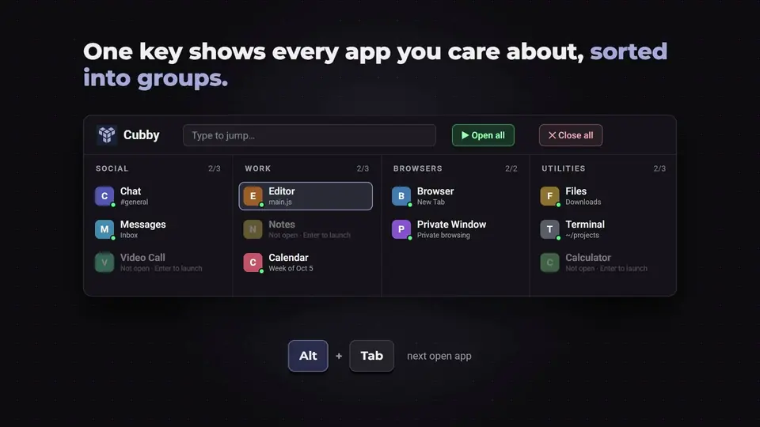
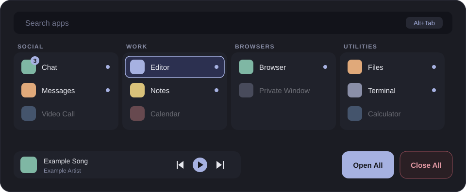

<h1 align="center">Cubby</h1>

<p align="center">
  <a href="https://github.com/danmano411/cubby-public/raw/main/assets/demo.mp4">
    
  </a>
</p>
<p align="center"><sub>Click to download the full video with sound. Made-up apps, Cubby's real UI. Music: "Happy Beats / Business Moves" by <a href="https://ende.app/en">ende.app</a>.</sub></p>

<p align="center">
  A grouped app tray and window switcher for Windows and macOS. One key shows every app you care
  about, sorted into groups, open ones lit and closed ones dimmed. Jump to one, or launch it.
</p>

<p align="center">
  <b>Beta.</b> Windows is the tested platform. macOS is experimental.
</p>

---

<p align="center">
  
</p>
<p align="center"><sub>An illustration with made-up apps, not a screenshot.</sub></p>

## Quickstart

**Option A: Installer**
1. Download the latest `Cubby-Setup-x.y.z.exe` (Windows) or `Cubby-x.y.z-universal.dmg` (macOS) from the [Releases page](https://github.com/danmano411/cubby-public/releases).
2. Run it. The builds are unsigned betas, so your OS will warn you once. See [Allowing an unsigned beta](#allowing-an-unsigned-beta).
3. Cubby starts in the system tray (the menu bar on macOS). A short setup walks you through your keys, your groups and your music player.

**Option B: Build from source**

Requires [Node.js](https://nodejs.org/) 22 or newer.
```bash
git clone https://github.com/danmano411/cubby-public.git
cd cubby-public
npm install
npm start                # run it from source
npm run dist             # build the installer into dist/
```
`npm run package` builds an unpacked app in `dist/` without an installer, which is quicker for testing.

## What it is, and why it exists

Alt+Tab is a flat list of windows. The taskbar and the Dock are a flat row of icons. Neither knows that
Discord and Slack are "social", that your editor and terminal belong together, or that the app you want is
not open yet and you would rather launch it than go looking.

Cubby is a different shape for the same job. You sort your apps into groups once. After that, one key
opens a tray with every group laid out side by side. Apps that are running are lit, apps that are not are
dimmed, and a click, an arrow key or a few typed letters takes you to one, or starts it. Everything else
(pings from your chat apps, a music strip, closing the whole day's apps in one go) hangs off the same tray.

It stays out of the way until you press the key, and it is built to be set up by clicking, not by editing a file.

## Features

**Switcher.** Press the switcher key (`Alt+Tab` on Windows, `Option+Tab` on macOS) and the tray opens with your previous app already selected. `Tab` steps through open apps, letting go of the modifier jumps to the one you picked, and a quick tap goes straight back to where you were, like the switcher you are used to.

**Search.** `Alt+~` opens the tray and keeps it open while you type. The list narrows as you go, the best match is selected, `Enter` takes you there. Apps that are closed show up too, and `Enter` launches them.

**Groups.** Apps live in named groups: Social, Work, Browsers, whatever you like. An app belongs to exactly one group. Apps that are open but in no group collect under **Other** so nothing is hidden.

**Side panels with pings.** Mark a group as a "ping group" and its apps' unread counts appear on a slim panel at the edge of your screen, so you can see that something is waiting without opening anything. Switch the group between **ping** mode and **do not disturb**. The counts come from the numbers your OS already puts on taskbar and Dock icons.

**Music strip and keys.** A strip shows what is playing, with previous, play/pause and next, and clicking the track jumps to the player. `Alt+[`, `Alt+\` and `Alt+]` control playback from anywhere. Players: Spotify; on Windows also **System media** (whatever is playing, browser tabs included); on macOS also Apple Music. Set the provider to `none` and the strip, panel and keys go away.

**Open All / Close All.** Open All launches every app in your groups. Close All closes them, asking each app to close politely first, and tells you which ones are probably waiting on a "save changes?" dialog. It needs a second click within three seconds so it cannot happen by accident.

**Voice (optional, off by default).** Say the wake word ("Cubby") and then "start" to open everything, or "close everything" to close your apps. Recognition runs on your machine with the speech engine your OS already has. Close needs higher confidence than open, since a mistake there costs more. Turn it on from the tray menu or in Settings, where you can also change the wake word and phrases.

**Setup wizard.** On first launch Cubby walks you through your keys, starter groups, which of your installed apps go where, your music player, and starting at login. It is also available later from the tray menu.

**Drag to group.** Open the tray, grab an app, drop it on a group. Drop it on **New group** to create one (the name is pre-filled with a sensible guess). It is saved immediately, and `Ctrl+Z` / `Ctrl+Y` (`Cmd+Z` / `Cmd+Shift+Z` on macOS) undo and redo any change to your groups while the tray is open.

**Multiple monitors.** The tray opens on the screen your mouse is on. By default the side panels and toasts follow the window you are working in: focus a window on your external monitor and they move to its right edge, switch to a window on your laptop screen and they come back. Clicking the desktop or minimizing everything leaves them where they are. In Settings you can pin them instead to your primary screen, to whichever screen the mouse is on, or to a specific monitor. Cubby handles mixed scaling (a 150% monitor next to a 250% one) and monitors arranged above or to the left of the primary, and re-lays everything out when you plug in or unplug a screen.

## Keyboard

These are the defaults. Every key can be changed in setup or in your config.

| Keys | What it does |
|---|---|
| `Alt+Tab` (macOS: `Option+Tab`) | Open the switcher. Hold the modifier and press `Tab` to move on, release it to switch. |
| `Alt+~` | Open the tray for searching and stay open while you type. |
| `Tab` / `Shift+Tab` | Next / previous open app. |
| Arrow keys | Move around the groups. |
| `Enter` | Switch to the selected app, or launch it if it is closed. |
| `Esc` | Clear the search, then close the tray. |
| `Alt+[` / `Alt+\` / `Alt+]` | Music: previous / play-pause / next. |
| `Ctrl+Z` / `Ctrl+Y` | Undo / redo a change to your groups, while the tray is open. |

Cubby replaces the system `Alt+Tab` by default on Windows. Turn **Replace Alt+Tab** off in the tray menu to get the Windows switcher back; the search key keeps working. An Alt shortcut does not fire while `Ctrl` or the Windows key is also held, so layouts that use AltGr are safe.

On macOS `Cmd+Tab` cannot be fully taken over by an app, so the default is `Option+Tab`. An experimental `Cmd+Tab` takeover is offered in setup.

## Platform support

| | Status | Notes |
|---|---|---|
| Windows 11 (x64) | **Beta** | The tested platform. Windows 10 should work but is not tested. |
| macOS 13+ (Apple Silicon and Intel) | **Experimental** | Runs on a real Mac, but has had very little testing. Expect rough edges and please report them. |
| Linux | Not supported | |

### Updates

On Windows, Cubby 0.1.7 and later updates itself (older versions need one manual download): it checks for a new release when it starts and every few hours,
downloads it in the background, and asks whether to restart now or install the next time it quits.
On macOS it cannot (updating an unsigned app is blocked by macOS), so download the new `.dmg` from the
[Releases page](https://github.com/danmano411/cubby-public/releases) when one comes out.

### macOS first run: permissions

macOS makes apps ask before they may look at or control other apps. Cubby asks for the following and explains each one on first run. It keeps working in a reduced mode if you say no.

| Permission | Why | Without it |
|---|---|---|
| **Accessibility** | Focus, minimize, maximize and close other apps' windows, and read the badges on Dock icons. | Switching and pings do not work. |
| **Screen Recording** | Read other apps' window titles (Cubby never records the screen). | Cubby shows app names but not window titles. |
| **Input Monitoring** | Hear the global shortcut keys. | The shortcuts do nothing; the tray menu still opens it. |
| **Microphone** and **Speech Recognition** | Only if you turn voice on. | Voice stays off. |

Grant them in **System Settings → Privacy & Security**. After changing one, quit and reopen Cubby.

## Allowing an unsigned beta

Cubby is not signed with a code-signing certificate and, on macOS, is not notarized. Certificates cost money and this project does not have them yet. Nothing is wrong with your download. Your OS simply cannot vouch for it, so it warns you the first time. You can check the source of every release in this repository and build it yourself with Option B above.

**Windows (SmartScreen).** When you run the installer and see "Windows protected your PC", click **More info**, then **Run anyway**. The installer is per-user and does not need administrator rights.

**macOS (Gatekeeper).** Open the `.dmg` and drag Cubby to Applications, then either:
- right-click Cubby in Applications, choose **Open**, then **Open** again in the dialog (macOS 14 and earlier), or
- try to open it once, then go to **System Settings → Privacy & Security**, scroll to the message about Cubby, and click **Open Anyway** (required on macOS 15 and later).

You only need to do this once per installed version. If macOS says the app "is damaged and can't be opened", clear the download flag and try again:
```bash
xattr -cr /Applications/Cubby.app
```

## Privacy

Everything stays on your computer.

- Your groups, keys and settings are one JSON file on your disk. Nothing is uploaded, and there is no account, analytics or telemetry.
- Voice recognition is offline. Audio is processed by your OS's built-in speech engine and is never saved or sent anywhere. The microphone is only used while voice is turned on.
- Pings come from accessibility information your OS already exposes about other apps (taskbar and Dock badge counts, and the window flashing for attention). Cubby reads the number; it never sees what a message says.
- Cubby makes no network requests of its own.

## Configuration

Cubby stores its settings in one file, which you can edit by hand or let the app manage:

| OS | Path |
|---|---|
| Windows | `%APPDATA%\Cubby\config.json` |
| macOS | `~/Library/Application Support/Cubby/config.json` |

Most of it can be changed in **Settings…** in the tray menu. For the rest, the tray menu has **Edit config.json…** and **Reload config**. A file that cannot be parsed is never overwritten: Cubby tells you what is wrong and leaves it for you to fix. Configs from older versions are upgraded automatically, and the original is kept as `config.v1.backup.json` next to it.

```jsonc
{
  "version": 2,
  "keys": { "switch": "Alt+Tab", "search": "Alt+`", "takeOverSystemSwitcher": true },
  "panels": { "socials": false, "music": false, "display": "focus" },  // "focus" (follow the focused window) | "primary" | "mouse" | a monitor
  "groups": [
    { "id": "social", "name": "Social", "pingGroup": true, "apps": ["discord", "slack"] },
    { "id": "work", "name": "Work", "apps": ["vscode"] }
  ],
  "music": { "provider": "spotify" },      // or "none"
  "voice": { "enabled": false, "wakeWord": "cubby", "commands": { "openAll": ["start"], "closeAll": ["close everything"] } },
  "apps": {}                                // per-app overrides
}
```

Apps are referenced by catalog id (`"discord"`) or described in full. Cubby ships a catalog of common apps with the right match rule and launch id for each OS, so you never write those by hand.

### Adding an app to the catalog

The catalog is plain JSON: [`src/config/catalog/windows.json`](src/config/catalog/windows.json) and [`src/config/catalog/mac.json`](src/config/catalog/mac.json). One line per app:

```json
{ "id": "example", "name": "Example", "category": "Utilities", "match": { "exe": "example.exe" }, "launch": { "appId": "Example.App" } }
```

`match` says which running windows belong to the app (`exe` on Windows, `bundleId` on macOS, optionally `title` for apps that run under a generic host). `launch` says how to start it (`appId`, `exe` or `uri` on Windows, `bundleId` on macOS). `badgeOffset`, `tint` and `note` are optional quirks. Use the same `id` on both platforms where the app exists on both. Pull requests are welcome, or open an [issue](https://github.com/danmano411/cubby-public/issues/new/choose) with the process or bundle id and Cubby's maintainers will add it.

## Uninstalling

**Windows:** Settings → Apps → Installed apps → Cubby → Uninstall. Your config stays in `%APPDATA%\Cubby` so a reinstall picks up where you left off; delete the folder to remove it.
**macOS:** quit Cubby, drag it from Applications to the Trash, and delete `~/Library/Application Support/Cubby` if you want your settings gone.

## Build and contribute

```bash
npm install
npm run check       # unit tests
npm run smoke       # opens every window on every connected display and exits 0 or 1
npm start           # run from source; CUBBY_DEBUG=1 prints a log
```

See [CONTRIBUTING.md](CONTRIBUTING.md) for the code layout, how to add a platform feature, and what to include in a bug report. If you have more than one monitor, a note about your setup (scaling and arrangement) in a bug report helps a lot.

## License

[MIT](LICENSE).
